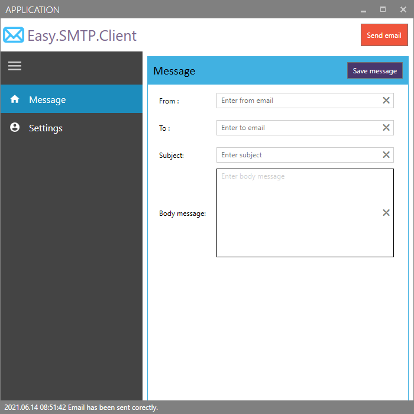

# Easy.SMTP.Client
A sample WPF application - Easy smtp client to test email sending.

## Screenshots

Example settings for Gmail SMTP Server
* Enter the following information in the SMTP account settings of your mail client:
* Server: smtp.gmail.com
* Encryption/Authentication: StartTLS
* Port: 587

https://www.google.com/settings/security/lesssecureapps

# Microsoft Visual Studio Installer Projects

https://marketplace.visualstudio.com/items?itemName=VisualStudioClient.MicrosoftVisualStudio2017InstallerProjects

